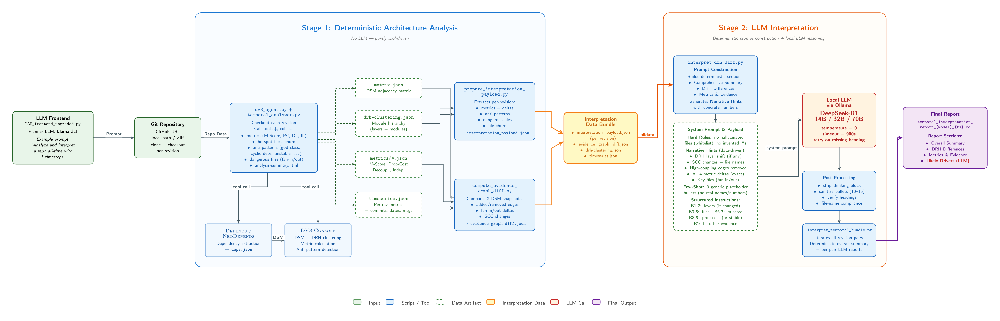

# ARCH_AGENT — Software Architecture Analysis Pipeline

A two-stage pipeline for automated software architecture analysis using DV8, NeoDepends, and local LLMs.

## Pipeline Overview



## What it does

1. **Stage 1 — Analyze**: Clone a GitHub repo, run DV8/NeoDepends dependency analysis across multiple commits (temporal), compute M-score, propagation cost, decoupling level, independence level, and generate time-series plots.
2. **Stage 2 — Interpret**: Feed the analysis results to a local reasoning LLM (DeepSeek-R1) to generate per-transition DRH diff reports, a combined temporal interpretation report, and answer specific architectural questions.

All outputs go into `REPOS_ANALYZED/<repo-name>/` (auto-created on first run).


## Prerequisites

| Tool | Version | Notes |
|------|---------|-------|
| Python | 3.10+ | |
| Java | 11+ | Required by DV8 and NeoDepends |
| DV8 CLI | latest | Manual install — see below |
| NeoDepends | latest | Coming soon — not required yet. [Releases](https://github.com/FreeworkEarth/neodepends/releases) |
| Ollama | latest | Installed automatically by `setup.sh` |
| Git | 2.x+ | |

### DV8 Setup (manual — one time)

DV8 requires a license and cannot be automated.

1. Download **DV8 Standard (Trial)** from [archdia.com](https://archdia.com/#shopify-section-1555640000024) — choose the version for your OS. The Standard edition includes `dv8-console` (the CLI used by this pipeline).

2. Unzip and place the folder at the standard location for your OS:

   | OS | Recommended path |
   |----|-----------------|
   | macOS | `~/tools/dv8/` |
   | Linux | `~/tools/dv8/` |
   | Windows | `C:\tools\dv8\` |

3. Add `dv8-console` to your PATH — run the command for your OS **once**, then restart your terminal:

   **macOS/Linux:**

   ```bash
   echo 'export PATH="$HOME/tools/dv8:$PATH"' >> ~/.zshrc && source ~/.zshrc
   ```

   **Windows (PowerShell):**

   ```powershell
   [Environment]::SetEnvironmentVariable("Path", $env:Path + ";C:\tools\dv8", "User")
   ```

   Then close and reopen PowerShell.

4. Launch the DV8 GUI once to activate the trial license. After that, `dv8-console` runs fully headlessly — no GUI needed again.

5. Verify:

   ```bash
   dv8-console --version
   ```

### NeoDepends Setup (coming soon)

> **Note:** NeoDepends integration is work in progress and not required to run the pipeline. Instructions will be added in a future release. Latest binaries: [github.com/FreeworkEarth/neodepends/releases](https://github.com/FreeworkEarth/neodepends/releases)

## Install

```bash
git clone https://github.com/FreeworkEarth/ARCH_AGENT.git
cd ARCH_AGENT
```

**macOS / Linux:**

```bash
chmod +x setup.sh
./setup.sh
```

**Windows (PowerShell):**

```powershell
powershell -ExecutionPolicy Bypass -File setup.ps1
```

The setup script installs Python dependencies, installs Ollama, and pulls `deepseek-r1:32b` (~19 GB).

## Quick Start

All commands run from `01_stage_analyze/`:

```bash
cd 01_stage_analyze
```

### Analyze + interpret a GitHub repo (all-in-one)

```bash
python3 LLM_frontend_upgraded.py \
  "analyze and interpret https://github.com/apache/commons-io.git all-time 5 timesteps with deepseek-r1:32b and answer: how did the architecture evolve?"
```

### Interpret an existing analysis folder (fast — skips re-analysis)

```bash
python3 LLM_frontend_upgraded.py \
  "interpret this temporal analysis folder '/path/to/REPOS_ANALYZED/commons-io/temporal_analysis_alltime_...' with deepseek-r1:32b and answer: what caused the m-score drop?"
```

If a prior interpretation run exists, you will be prompted to reuse it (fast, ~30s) or re-run the LLM (slow, ~10min).

### Toy example (TrainTicket — god-class → refactored)

The toy example repo is at: [ARCH_ANALYSIS_TRAINTICKET_TOY_EXAMPLES_MULTILANG](https://github.com/FreeworkEarth/ARCH_ANALYSIS_TRAINTICKET_TOY_EXAMPLES_MULTILANG/tree/temporal)

```bash
python3 LLM_frontend_upgraded.py \
  "analyze and interpret ARCH_ANALYSIS_TRAINTICKET_TOY_EXAMPLES_MULTILANG all-time in 2 timesteps on branch temporal with deepseek-r1:32b and answer: how did the architecture change from the god-class version to the refactored version?"
```

## Pipeline stages

```
GitHub URL / local repo
        ↓
01_stage_analyze/
  dv8_agent.py           ← clones repo, runs DV8 + NeoDepends per commit
  temporal_analyzer.py   ← selects N commits, iterates stage 1
  metric_plotter.py      ← generates time-series plots (PNG)
        ↓
  REPOS_ANALYZED/<repo>/temporal_analysis_*/
    timeseries.json       ← metrics per revision
    plots/                ← PNG charts
    INPUT_INTERPRETATION/ ← DRH diff payloads
        ↓
02_stage_interpret/
  interpret_temporal_bundle.py  ← orchestrates per-transition LLM calls
  interpret_drh_diff.py         ← per-transition DRH diff report (LLM)
  interpret_metrics.py          ← metric explanation
        ↓
  INPUT_INTERPRETATION/<timestamp>_<model>/
    temporal_interpretation_report_*.md  ← combined report
    drh_diff_report_*_new{N}_old{N}.md  ← per-transition reports
    USER_ANSWER_*.md                     ← Q&A answers
```

## Models

| Model | RAM required | Speed | Quality |
|-------|-------------|-------|---------|
| `deepseek-r1:14b` | ~12 GB | ~3-5 min/transition | Good |
| `deepseek-r1:32b` | ~24 GB | ~8-10 min/transition | Better (default) |
| `deepseek-r1:70b` | ~140 GB | Slow | Best (cluster recommended) |

`deepseek-r1:32b` is pulled automatically by `setup.sh`. To install a larger model manually:

```bash
ollama pull deepseek-r1:70b
```

Then use it by adding `with deepseek-r1:70b` to your prompt:

```bash
python3 LLM_frontend_upgraded.py \
  "analyze and interpret https://github.com/apache/commons-io.git all-time 5 timesteps with deepseek-r1:32b and answer: how did the architecture evolve?"
```
