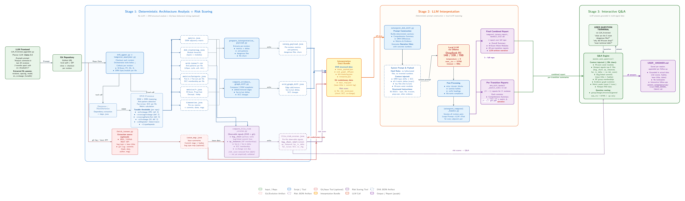

# ARCH_AGENT — AI Agent for Multi-Orchestrated Automatic Software Architecture Analysis

> *One natural-language command. One agent. Full temporal architecture intelligence.*

ARCH_AGENT is a fully autonomous, multi-stage AI agent that clones a repository, extracts structural dependency data across its entire history, detects architectural anti-patterns, computes temporal decay metrics, correlates structural coupling with bug-linked development churn, and answers specific architectural questions, all orchestrated automatically from a single prompt.

No manual scripting. No configuration files. Just describe what you want to know.

---

## Why this matters

Modern software projects accumulate **architectural technical debt silently** structural anti-patterns, coupling violations, and dependency cycles grow revision by revision, invisible in code reviews and sprint retrospectives. By the time the maintenance cost becomes obvious, the damage spans years of commits.

ARCH_AGENT makes this decay **visible, quantified, and explainable**:

- **Temporal** — analysis runs across the full git history, not just a snapshot
- **Multi-signal** — combines structural coupling, anti-pattern detection, bug-linked churn, and co-change patterns
- **Multi-language** — supports Java, Python (via NeoDepends) and C#, TypeScript, C/C++, and 10+ more languages (via SciTools Understand)
- **Agentic** — a local reasoning LLM (DeepSeek-R1) orchestrates all stages, interprets results, and answers domain-specific architectural questions
- **Auto-refactoring** — Stage 4 iteratively applies LLM-generated refactoring actions and re-measures architecture quality
- **Reproducible** — every output is a structured file, fully offline, no vendor lock-in

---

## Pipeline Overview



---

## Four-Stage Architecture

### Stage 1 — Analyze (`01_stage_analyze/`)
Clones the repository, selects evenly spaced commits across the target time window, runs dependency extraction per revision (NeoDepends for Java/Python, SciTools Understand for C#/TypeScript/others), runs DV8 structural analysis, computes M-score, propagation cost, decoupling level, and independence level, detects architectural anti-patterns (modularity violations, cliques, package cycles, unhealthy inheritance), and generates time-series data.

### Stage 2 — Interpret (`02_stage_interpret/`)
Feeds the analysis results to a local reasoning LLM. Generates per-transition DRH diff reports, a combined temporal interpretation report, and answers a specific architectural question with evidence-backed reasoning — including metric trajectory, anti-pattern group rankings, fan-in growth over time, and worst-file analysis with bug-linked churn.

### Stage 3 — Fast Q&A (`03_stage_query/`)
Answers follow-up questions in **under 30 seconds** using a pre-built 4-layer TF-IDF index — no re-running DV8 or Stage 2. Supports interactive sessions, ad-hoc queries, and architecture concept lookups.

### Stage 4 — Auto-Refactor (`04_stage_refactor/`)
Iteratively applies LLM-generated refactoring actions to the codebase, re-runs DV8 analysis after each iteration, and measures M-score improvement. Generates a manager-friendly `REFACTOR_REPORT.md` summarizing baseline metrics, each iteration's action and impact, and final before/after comparison.

---

## Supported Languages

| Language | Dependency Extractor | License Required? |
|----------|---------------------|-------------------|
| **Java** | NeoDepends (built-in) | No (open source) |
| **Python** | NeoDepends (built-in) | No (open source) |
| **C#** / .NET | SciTools Understand | Yes (Understand license) |
| **TypeScript** / JavaScript | SciTools Understand | Yes (Understand license) |
| **C / C++** | SciTools Understand | Yes (Understand license) |
| **Ada** | SciTools Understand | Yes (Understand license) |
| **Fortran** | SciTools Understand | Yes (Understand license) |
| **VHDL** | SciTools Understand | Yes (Understand license) |
| **Delphi / Pascal** | SciTools Understand | Yes (Understand license) |
| **COBOL** | SciTools Understand | Yes (Understand license) |
| **JOVIAL** | SciTools Understand | Yes (Understand license) |
| **Visual Basic** | SciTools Understand | Yes (Understand license) |

> **Note:** Java and Python work out of the box. For all other languages, you need a [SciTools Understand](https://scitools.com/) license. The pipeline auto-detects the language and chooses the right extractor.

---

## Prerequisites

| Tool | Version | Notes |
|------|---------|-------|
| Python | 3.10+ | |
| Java | 11+ | Required by DV8 |
| DV8 CLI | latest | Manual install — see below |
| NeoDepends | latest | Built-in for Java/Python ([Releases](https://github.com/FreeworkEarth/neodepends/releases)) |
| Ollama | latest | Installed automatically by `setup.sh` |
| Git | 2.x+ | |
| SciTools Understand | 6.x+ | **Optional** — only needed for C#, TypeScript, C/C++, and other non-Java/Python languages |

---

## Install

```bash
git clone https://github.com/FreeworkEarth/ARCH_AGENT.git
cd ARCH_AGENT
```

**macOS / Linux:**
```bash
chmod +x setup.sh
./setup.sh
```

**Windows (PowerShell):**
```powershell
powershell -ExecutionPolicy Bypass -File setup.ps1
```

The setup script installs Python dependencies, installs Ollama, and pulls `deepseek-r1:32b` (~19 GB).

### Ollama LLM Setup

The pipeline uses [Ollama](https://ollama.ai/) for local LLM inference. After installing Ollama:

```bash
# Required — reasoning model for interpretation (default)
ollama pull deepseek-r1:32b

# Optional — refactoring model for Stage 4 auto-refactor
# Create the custom refactor model from the Modelfile:
ollama create qwen3-coder-30b-refactor -f 04_stage_refactor/qwen3-coder-30b-refactor.Modelfile
```

**Model options:**

| Model | RAM required | Speed | Quality |
|-------|-------------|-------|---------|
| `deepseek-r1:14b` | ~12 GB | ~3–5 min/transition | Good |
| `deepseek-r1:32b` | ~24 GB | ~8–10 min/transition | Better (default) |
| `deepseek-r1:70b` | ~140 GB | Slow | Best (cluster recommended) |

### DV8 Setup (one-time, manual)

DV8 requires a license and cannot be automated.

1. Download **DV8 Standard (Trial)** from [archdia.com](https://archdia.com/#shopify-section-1555640000024) — choose the version for your OS.

2. Unzip and place the folder at the standard location:

   | OS | Recommended path |
   |----|-----------------|
   | macOS / Linux | `/Applications/DV8_Standard/` or `~/tools/dv8/` |
   | Windows | `C:\tools\dv8\` |

3. Launch the DV8 GUI once to activate the trial license. After that, `dv8-console` runs fully headlessly.

4. Verify:
   ```bash
   dv8-console --version
   ```

### SciTools Understand Setup (optional — for C#, TypeScript, C/C++, etc.)

Only needed if you want to analyze languages beyond Java/Python.

1. Download from [scitools.com](https://scitools.com/) and install.

2. Activate your license (trial or full).

3. Verify:
   ```bash
   # macOS
   /Applications/Understand.app/Contents/MacOS/und version

   # Linux
   und version

   # Windows
   und.exe version
   ```

4. The pipeline auto-detects when Understand is needed based on the repository's language.

**Understand language names** (used internally by the pipeline):

| Your Language | Understand `-languages` flag |
|---------------|------------------------------|
| C# | `C#` |
| TypeScript / JavaScript | `Web` |
| C / C++ | `C++` |
| Mixed C# + TypeScript | `C#` + `Web` (both flags) |

---

## Usage

All commands run from the ARCH_AGENT root:

```bash
cd ARCH_AGENT
```

### Full pipeline — analyze + interpret + answer (GitHub URL)

```bash
python3 01_stage_analyze/LLM_frontend_upgraded.py \
  "analyze and interpret https://github.com/apache/commons-io.git \
   last 3 years 36 commits 1 per month with deepseek-r1:32b \
   and answer: what are the 5 most dangerous files?"
```

### Temporal analysis with specific revision count and spacing

```bash
python3 01_stage_analyze/LLM_frontend_upgraded.py \
  "analyze https://github.com/apache/commons-io.git \
   temporal 3 revisions 1 year apart with automated refactoring"
```

### C# / .NET repository (requires Understand)

```bash
python3 01_stage_analyze/LLM_frontend_upgraded.py \
  "analyze https://github.com/TrilonIO/aspnetcore-angular-universal \
   with understand temporal 3 revisions 1 year apart with automated refactoring"
```

### TypeScript repository (requires Understand)

```bash
python3 01_stage_analyze/LLM_frontend_upgraded.py \
  "analyze https://github.com/microsoft/vscode \
   with understand temporal 2 revisions 1 year apart with automated refactoring"
```

### All-time analysis (first commit to now)

```bash
python3 01_stage_analyze/LLM_frontend_upgraded.py \
  "analyze and interpret commons-io all time 10 timesteps \
   with deepseek-r1:32b and answer: how has architecture quality changed over the full history?"
```

### Analyze only — no LLM interpretation

```bash
python3 01_stage_analyze/LLM_frontend_upgraded.py \
  "only analyze commons-io last 3 years 36 commits 1 per month"
```

### Re-use existing analysis, only re-run interpretation

```bash
python3 01_stage_analyze/LLM_frontend_upgraded.py \
  "interpret this temporal analysis folder '/path/to/REPOS_ANALYZED/commons-io/temporal_analysis_...' \
   with deepseek-r1:32b and answer: what caused the m-score drop?"
```

### Fast Q&A — instant answers from existing results (Stage 3)

```bash
# Single question
python3 01_stage_analyze/LLM_frontend_upgraded.py "query commons-io: which files should I refactor first?"

# Interactive Q&A session
python3 01_stage_analyze/LLM_frontend_upgraded.py "query commons-io"
```

---

## Test with Toy Examples

The [TOY Examples repository](https://github.com/FreeworkEarth/ARCH_ANALYSIS_TRAINTICKET_TOY_EXAMPLES_MULTILANG) contains small, hand-crafted examples that demonstrate god-class anti-patterns and their refactored versions — ideal for quick testing.

### Java (NeoDepends — no extra tools needed)

```bash
python3 01_stage_analyze/LLM_frontend_upgraded.py \
  "analyze and interpret https://github.com/FreeworkEarth/ARCH_ANALYSIS_TRAINTICKET_TOY_EXAMPLES_MULTILANG \
   all-time in 2 timesteps on branch temporal with deepseek-r1:32b \
   and answer: how did the architecture change from the god-class version to the refactored version?"
```

### Python (NeoDepends — no extra tools needed)

Same command — the pipeline auto-detects Python files and uses NeoDepends.

### C# or TypeScript (requires Understand)

For C#/TypeScript toy examples, add `with understand`:

```bash
python3 01_stage_analyze/LLM_frontend_upgraded.py \
  "analyze and interpret https://github.com/FreeworkEarth/ARCH_ANALYSIS_TRAINTICKET_TOY_EXAMPLES_MULTILANG \
   with understand all-time in 2 timesteps on branch temporal with deepseek-r1:32b \
   and answer: how did the architecture change?"
```

---

## Stage 4 — Auto-Refactor

Stage 4 is an iterative refactoring loop:

1. **Q1** — LLM identifies worst anti-patterns and problem areas
2. **Q2** — LLM proposes 3 prioritized concrete refactoring actions
3. **Apply** — Action 1 is applied to a copy of the codebase
4. **Re-analyze** — DV8 re-runs on the modified code, M-score is measured
5. **Repeat** — if M-score improved, loop continues with next iteration

After completion, a `REFACTOR_REPORT.md` is generated with:
- Baseline vs final architecture metrics
- Per-iteration actions and M-score deltas
- Key takeaways and recommendations

### Usage

```bash
# 3 refactoring iterations (default)
python3 01_stage_analyze/LLM_frontend_upgraded.py \
  "analyze https://github.com/apache/commons-io.git \
   temporal 5 revisions 1 year apart with automated refactoring"

# Explicit iteration count
python3 01_stage_analyze/LLM_frontend_upgraded.py \
  "analyze https://github.com/apache/commons-io.git \
   temporal 5 revisions 1 year apart with automated refactoring 5 iterations"
```

### Generate report manually (on existing analysis)

```bash
python3 04_stage_refactor/generate_refactor_report.py \
  --temporal-root REPOS_ANALYZED/commons-io/temporal_analysis_...
```

### Refactoring LLM

Stage 4 uses a custom Ollama model (`qwen3-coder-30b-refactor`) tuned for code refactoring. Create it with:

```bash
ollama create qwen3-coder-30b-refactor -f 04_stage_refactor/qwen3-coder-30b-refactor.Modelfile
```

---

## Future: API-Based Refactoring (Claude / Codex)

> **Planned** — not yet implemented.

Stage 4 currently uses local Ollama models for code refactoring. A future enhancement will allow using cloud API models (Claude, Codex/GPT) for higher-quality refactoring:

```bash
# Future usage (not yet implemented):
python3 01_stage_analyze/LLM_frontend_upgraded.py \
  "analyze commons-io temporal 5 revisions 1 year apart \
   with automated refactoring using api-key=sk-... model=claude-opus-4-6"
```

This is expected to **significantly improve** refactoring quality since frontier models have much stronger code understanding than local 30B models.

---

## Output Structure

```
REPOS_ANALYZED/<repo>/temporal_analysis_<timestamp>/
├── REFACTOR_REPORT.md                         ← Manager-friendly summary (auto-generated)
├── INPUT_INTERPRETATION/
│   ├── timeseries.json                        ← M-score, PC, DL, IL per revision
│   ├── plots/                                 ← Time-series metric plots (PNG)
│   ├── EVIDENCE_GRAPH_DIFF/                   ← Fan-in/fan-out diffs per transition
│   └── SINGLE_REVISION_ANALYSIS_DATA/         ← DV8 outputs per revision
├── OUTPUT_INTERPRETATION/
│   └── <run>/
│       ├── temporal_interpretation_report_*.md ← Full temporal report
│       ├── drh_diff_report_*.md               ← Per-transition analysis
│       └── USER_ANSWER_*.md                   ← Answer to your question
└── data_repositories/
    ├── 01_<repo>_<date>/                      ← Newest revision
    │   └── OutputData/                        ← DV8 analysis results
    ├── 02_<repo>_<date>/                      ← Older revision
    └── 003_<repo>_loop1_<date>/               ← Refactoring iteration 1
```

---

## What the agent triggers automatically

| Step | Script | What it does |
|------|--------|--------------|
| 1 | `temporal_analyzer.py` | Clones repo, selects commits, runs DV8 on each |
| 2 | `backfill_temporal_payloads.py` | Builds interpretation payloads + evidence graph diffs |
| 3 | `fetch_github_issues.py` | Auto-detects JIRA or GitHub Issues for bug churn |
| 4 | `export_dv8_binary_files.py` | Converts DV8 binary files → readable JSON + CSV |
| 5 | `interpret_temporal_bundle.py` | LLM interprets all pairwise DRH transitions |
| 6 | Q&A | LLM answers your architectural question |
| 7 | `generate_refactor_report.py` | Produces `REFACTOR_REPORT.md` after auto-refactor |

---

## Backend switching (cloud / cluster)

Switch from Ollama to any OpenAI-compatible endpoint without changing code:

```bash
# vLLM on GPU cluster
ARCH_AGENT_LLM_BACKEND=vllm \
ARCH_AGENT_LLM_BASE_URL=http://gpu-node:8000 \
  python3 01_stage_analyze/LLM_frontend_upgraded.py "query commons-io: worst files?"

# Any OpenAI-compatible API
ARCH_AGENT_LLM_BACKEND=api \
ARCH_AGENT_LLM_BASE_URL=https://api.openai.com/v1 \
ARCH_AGENT_LLM_API_KEY=your-key \
  python3 01_stage_analyze/LLM_frontend_upgraded.py "query commons-io: explain m-score"
```

---

## Environment Variables

| Variable | Purpose | Required? |
|----------|---------|-----------|
| `GH_TOKEN` / `GITHUB_TOKEN` | GitHub token — improves bug churn accuracy via typed issue→commit linking | Recommended |
| `OLLAMA_MODEL` | Override default LLM model | Optional |
| `OLLAMA_ENDPOINT` | Ollama server URL (default: `http://127.0.0.1:11434`) | Optional |
| `ARCH_AGENT_LLM_BACKEND` | `ollama` / `vllm` / `api` | Optional |
| `ARCH_AGENT_LLM_BASE_URL` | Base URL for non-Ollama backends | Optional |
| `ARCH_AGENT_LLM_API_KEY` | API key for cloud backends | Optional |

---

## Repository Structure

```
ARCH_AGENT/
├── 01_stage_analyze/          ← Stage 1: Analysis pipeline + NL frontend
│   ├── LLM_frontend_upgraded.py    ← Main entry point (NL → plan → execute)
│   ├── dv8_agent.py                ← DV8 orchestration + Understand integration
│   ├── temporal_analyzer.py        ← Git history traversal + revision selection
│   └── understand_dependency_export.py  ← Understand → JSON dependency export
├── 02_stage_interpret/        ← Stage 2: LLM interpretation
│   ├── interpret_temporal_bundle.py ← Temporal report generation
│   └── interpret_drh_diff.py       ← Per-transition DRH analysis
├── 03_stage_query/            ← Stage 3: Fast Q&A (RAG + LLM)
│   ├── query_engine.py             ← TF-IDF retrieval + LLM answer
│   └── rag_index.py                ← 4-layer index builder
├── 04_stage_refactor/         ← Stage 4: Auto-refactoring + reporting
│   ├── generate_refactor_report.py ← Manager report generator
│   └── qwen3-coder-30b-refactor.Modelfile ← Ollama model config
├── REPOS_ANALYZED/            ← Analysis outputs (auto-created, gitignored)
├── EXAMPLE_COMMANDS.md        ← More command examples
├── FUTURE_IDEAS.md            ← Roadmap and planned features
└── pipeline_diagram.png       ← Visual pipeline overview
```

---

## License

MIT
